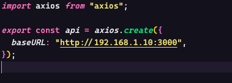
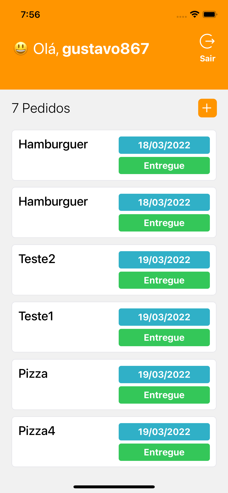
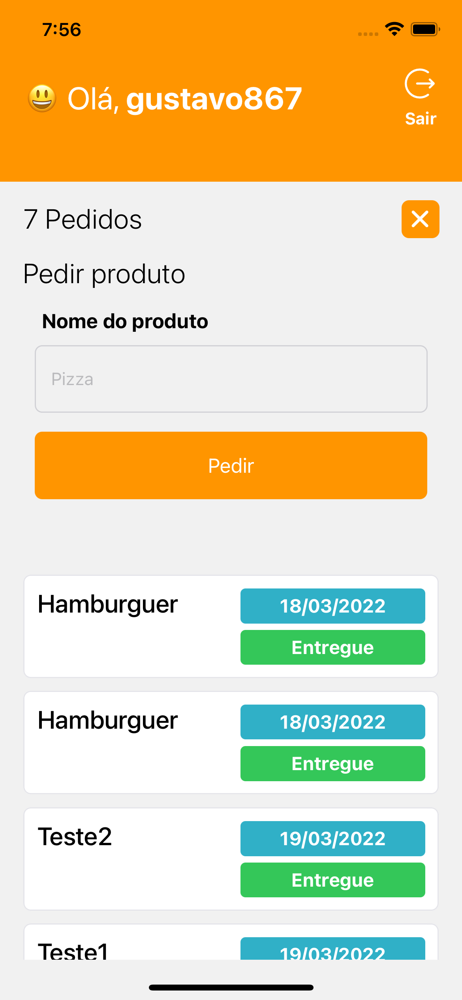
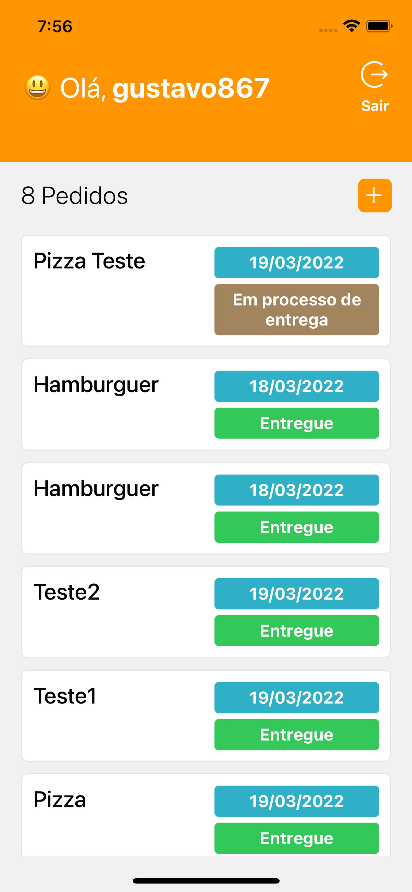
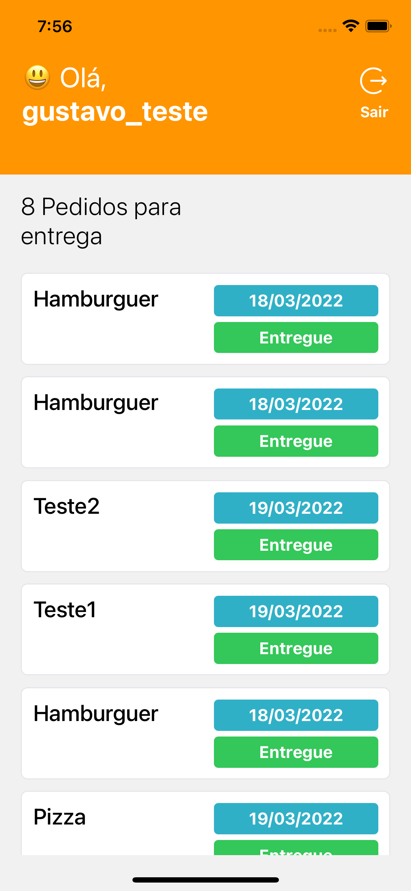
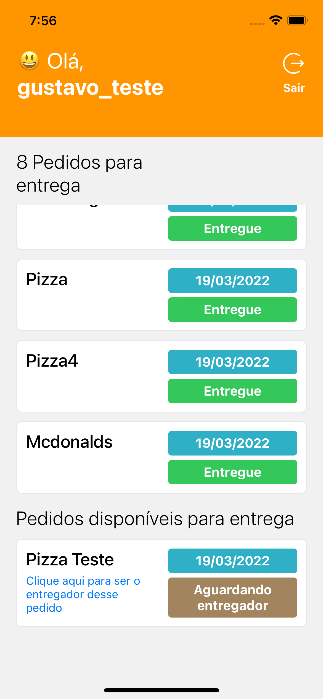
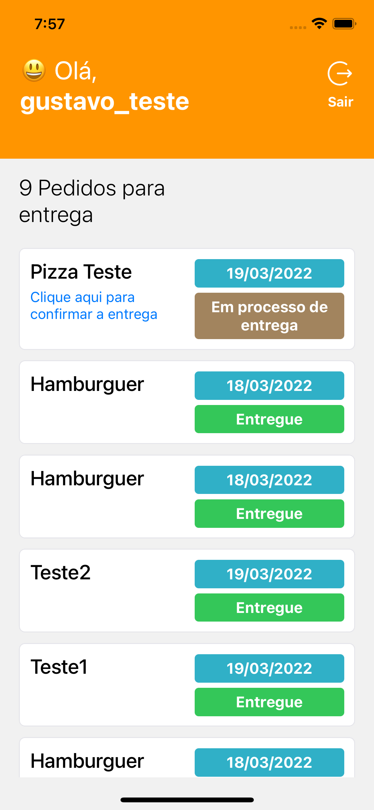

# delivery-mobile

```
Instale as dependências
$ yarn ou npm install

Instale a cli do expo
$ npm install --global expo-cli


Rode o projeto
$ expo start
```

# Certifique-se de que o server está rodando

### Atualize a url da api no arquivo api.ts, para a url da api, se estiver rodando a api no localhost, coloque seu ip e a porta.

`ip do seu pc:porta onde a api ta rodando`



## Preview da aplicação

### Cliente





### Entregador




